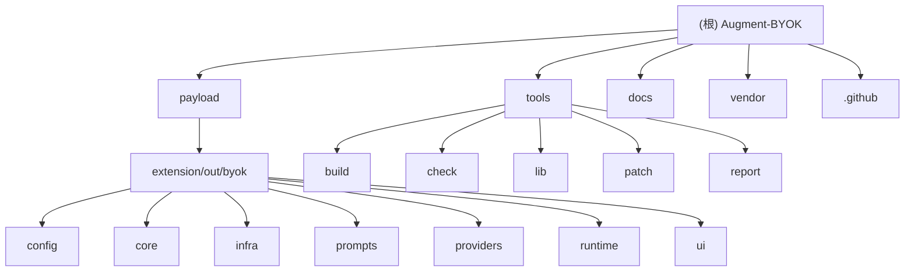

# Augment-BYOK

> 单一 VSIX 补丁：将 Augment VSCode 扩展的 **13 个 LLM 数据面端点** 按路由转到 BYOK（Bring Your Own Key），支持 Streaming，其它端点保持官方行为；支持运行时一键回滚。

## 项目愿景

为 Augment VSCode 扩展用户提供 **自带 API Key** 的能力，在保持官方功能完整性的同时，允许用户使用自己的 LLM 服务提供商（OpenAI、Anthropic、Gemini 等）。

核心原则：
- **最小破坏面**：只接管 13 个 LLM 数据面端点，其余 58 个端点保持官方行为
- **可审计**：构建过程透明，产物包含锁文件和覆盖率报告
- **可回滚**：运行时一键切换回官方链路，无需重装

## 架构总览

```
+------------------+     +-------------------+     +------------------+
|   Augment VSCode |---->|  BYOK Shim/Router |---->|  LLM Providers   |
|   Extension      |     |  (进程内拦截)      |     |  (OpenAI/Claude) |
+------------------+     +-------------------+     +------------------+
         |                        |
         |  mode=official         |  mode=byok
         v                        v
+------------------+     +-------------------+
|  官方 Augment    |     |  BYOK 语义实现     |
|  后端服务        |     |  (13个LLM端点)     |
+------------------+     +-------------------+
```

构建流程：
1. 下载上游 VSIX -> `.cache/work/*`
2. overlay payload -> `extension/out/byok/*`
3. patch `package.json`：添加 BYOK 命令
4. patch `extension.js`：注入 interceptor + bootstrap + shim
5. guard 检查：无 autoAuth、合约验证、语法检查
6. repack -> `dist/*.vsix`

## 模块结构图



## 模块索引

| 模块路径 | 职责 | 入口文件 | 语言 |
|---------|------|---------|------|
| `payload/extension/out/byok/` | BYOK 核心运行时代码 | `runtime/bootstrap.js` | JS (CommonJS) |
| `payload/extension/out/byok/config/` | 配置管理与持久化 | `config.js` | JS |
| `payload/extension/out/byok/core/` | 核心逻辑（路由、协议、聊天） | `router.js`, `shim.js` | JS |
| `payload/extension/out/byok/providers/` | LLM 提供商适配器 | `openai.js`, `anthropic.js`, `gemini.js` | JS |
| `payload/extension/out/byok/prompts/` | 提示词模板与处理 | `common.js` | JS |
| `payload/extension/out/byok/ui/` | 配置面板 WebView | `config-panel.js` | JS/HTML/CSS |
| `tools/` | 构建、补丁、检查工具 | `build/build-vsix.js` | JS |

## 运行与开发

### 安装（推荐：Releases）

```bash
# 从 GitHub Releases 下载 rolling 版本
# VS Code -> Extensions -> ... -> Install from VSIX... -> Reload Window
```

### 本地构建

```bash
# 前置：Node.js 20+, Python 3, 可访问 VS Marketplace
npm run build:vsix
# 产物：dist/augment.vscode-augment.<version>.byok.vsix
```

### 常用命令

- `npm run build:vsix` - 构建 BYOK VSIX
- `npm run upstream:analyze` - 分析上游端点
- `npm run report:coverage` - 生成端点覆盖率报告

### VS Code 命令面板

- `BYOK: Open Config Panel` - 打开配置面板
- `BYOK: Enable` / `BYOK: Disable (Rollback)` - 启用/禁用 BYOK
- `BYOK: Reload Config` - 重新加载配置
- `BYOK: Clear History Summary Cache` - 清理历史摘要缓存

## 测试策略

### 构建期（自动）

- patch marker 存在检查
- guard: 产物不含 `autoAuth` 相关字符串
- guard: injector marker 存在
- `node --check out/extension.js` 语法检查
- BYOK 合约检查 (`tools/check/byok-contracts.js`)

### 运行期（手动）

- BYOK 关闭：Augment 原生功能正常
- BYOK 开启：13 个 LLM 端点按路由工作
- 热更新：面板 Save 后下一次请求生效
- 回滚：Disable 后立即回到官方链路
- 错误处理：缺 key/401/429/5xx/timeout 信息可读且不泄露敏感信息

## 编码规范

- **单文件 <= 400 行**；单函数 <= 80 行；单模块单职责
- **patch 薄、域层厚**：注入只交控制权给 shim；逻辑放在 `payload/extension/out/byok/*`
- **失败可控**：异常必须可回落 official（`return undefined` / empty stream）
- **运行时只用 `fetch`**：避免 `child_process` 等高风险面
- **日志必须脱敏**：永不输出 key/token 全文

运行时代码为 CommonJS JS；类型边界用 `normalize/validate` 固定形状。

## AI 使用指引

### 关键入口点

1. **构建入口**: `tools/build/build-vsix.js` - 理解构建流程
2. **运行时入口**: `payload/extension/out/byok/runtime/bootstrap.js` - 理解初始化
3. **路由核心**: `payload/extension/out/byok/core/router.js` - 理解端点路由
4. **API 拦截**: `payload/extension/out/byok/runtime/shim.js` - 理解请求处理

### 文档阅读顺序

- **使用**: `README.md` -> `docs/CONFIG.md`
- **开发**: `docs/ARCH.md` -> `docs/CONFIG.md` -> `docs/ENDPOINTS.md`
- **审查**: `docs/CI.md` -> `docs/ARCH.md` -> `docs/ENDPOINTS.md`

### 端点范围

- **BYOK 语义实现 (13个)**:
  - callApi (6): `/get-models`, `/chat`, `/completion`, `/chat-input-completion`, `/edit`, `/next_edit_loc`
  - callApiStream (7): `/chat-stream`, `/prompt-enhancer`, `/instruction-stream`, `/smart-paste-stream`, `/next-edit-stream`, `/generate-commit-message-stream`, `/generate-conversation-title`

- **官方保持 (58个)**: Remote Agents, GitHub, 账号订阅, 反馈遥测等

### 支持的 Provider 类型

- `openai_compatible` - OpenAI 兼容 API
- `openai_responses` - OpenAI Responses API
- `anthropic` - Anthropic Claude API
- `gemini_ai_studio` - Google Gemini API

## 变更记录 (Changelog)

### 2026-01-18
- 初始化 AI 上下文文档

